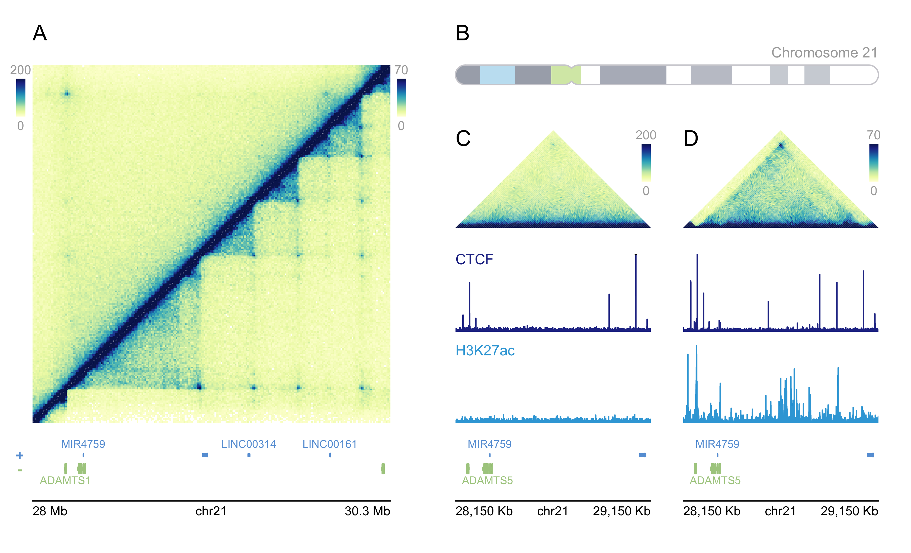

#  

## Overview

`BentoBox` is a genomic data vizualization package for R. Using `grid`
graphics, `BentoBox` empowers users to programmatically and flexibly
generate multi-panel figures. `BentoBox` accomplishes these goals by
utilizing 1) a coordinate-based plotting system, and 2) edge-to-edge
containerized data visualization. The coordinate-based plotting system
grants users precise control over the size, position, and arrangement of
plots. Its edge-to-edge plotting functions preserve the mapping between
user-specified containers and the represented data. This allows users to
stack plots with confidence that vertically aligned data will correspond
to the same regions. For more information about BentoBox’s philosophy
and design, check out the `Our Philosophy` page.

Specialized for genomic data, `BentoBox` also contains functions to read
and plot multi-omic data quickly and easily. `BentoBox` can address an
endless number of use cases, including: dynamic exploration of genomic
data, arrangment into multi-omic layouts, and survey plotting for
quickly viewing data across the genome. Check out our `vignettes` for
detailed examples and suggested use cases!

## Installation

BentoBox can be installed from GitHub as follows:

``` r
if (!requireNamespace("BiocManager", quietly = TRUE))
    install.packages("BiocManager")

if (!requireNamespace("remotes", quietly = TRUE))
    BiocManager::install("remotes")

remotes::install_github("PhanstielLab/BentoBox")
package.version("BentoBox")
```

## Usage



``` r
## Load libraries and datasets
library("BentoBox")
library("org.Hs.eg.db")
library("TxDb.Hsapiens.UCSC.hg19.knownGene")
data("cytoBand.Hsapiens.UCSC.hg19")
data("bb_gmHicData")
data("bb_imrHicData")
data("bb_gmCTCFData")
data("bb_imrCTCFData")
data("bb_imrH3K27acData")
data("bb_gmH3K27acData")

## Create a BentoBox page
bb_pageCreate(width = 7, height = 4.25, default.units = "inches")

##########################
######## Panel A #########
##########################

## Text section label
bb_plotText(label = "A", fontface = "bold", fontsize = 14,
            x = 0.25, y = 0.25, just = "left", default.units = "inches")

## Set genomic and dimension parameters in a `bb_params` object
params_a <- bb_params(chrom = "chr21", chromstart = 28000000, chromend = 30300000, 
                      assembly = "hg19",
                      x = 0.25, width = 2.75, just = c("left", "top"), default.units = "inches")

## Double-sided Hi-C Plot
hicPlot_top <- bb_plotHicSquare(data = bb_gmHicData, params = params_a,
                                zrange = c(0, 200), resolution = 10000,
                                half = "top", palette = colorRampPalette(c("white", "#225EA8")),
                                y = 0.5, height = 2.75)
hicPlot_bottom <- bb_plotHicSquare(data = bb_imrHicData, params = params_a,
                                zrange = c(0, 70), resolution = 10000,
                                half = "bottom", palette = colorRampPalette(c("white", "#253494")),
                                y = 0.5, height = 2.75)

## Annotate Hi-C heatmap legends
bb_annoHeatmapLegend(plot = hicPlot_top, x = 3.05, y = 0.5,
                     width = 0.12, height = 1.1, just = c("left", "top"), 
                     default.units = "inches")

bb_annoHeatmapLegend(plot = hicPlot_bottom, x = 3.05, y = 3.25,
                     width = 0.12, height = 1.1, just = c("left", "bottom"),
                     default.units = "inches")

## Plot gene track
genes_a <- bb_plotGenes(params = params_a, stroke = 1,
                        y = 3.35, height = 0.6)

## Annotate genome label
bb_annoGenomeLabel(plot = genes_a, params = params_a, 
                   scale = "Mb", fontsize = 8,
                   y = 4)

##########################
######## Panel B #########
##########################

## Text section label
bb_plotText(label = "B", fontface = "bold", fontsize = 14,
            x = 3.5, y = 0.25, just = "left", default.units = "inches")

## Plot ideogram
bb_plotIdeogram(chrom = "chr21",
                x = 3.5, y = 0.5,
                width = 3.25, height = 0.25, just = c("left", "top"), default.units = "inches")

## Add text to ideogram
bb_plotText(label = "Chromosome 21", fontsize = 10,
            x = 5.125, y = 0.35, just = "center", default.units = "inches")

##########################
######## Panel C #########
##########################

## Text section label
bb_plotText(label = "C", fontface = "bold", fontsize = 14,
            x = 3.5, y = 1, just = c("left", "top"), default.units = "inches")

## Set genomic and dimension parameters in a `bb_params` object
params_c <- bb_params(chrom = "chr21", chromstart = 28150000, chromend = 29150000, assembly = "hg19",
                      x = 3.5, width = 1.5, default.units = "inches")

## Set signal track data ranges
ctcf_range <- bb_params(range = c(0, 77))
hk_range <- bb_params(range = c(0, 32.6))

## Plot Hi-C triangle
hic_gm <- bb_plotHicTriangle(data = bb_gmHicData, params = params_c,
                             zrange = c(0, 200), resolution = 10000,
                             y = 1.75, height = 0.75, just = c("left", "bottom"))

## Annotate Hi-C heatmap legend
bb_annoHeatmapLegend(plot = hic_gm, fontsize = 7, 
                     x = 5, y = 1, width = 0.08, height = 0.6, 
                     just = c("right", "top"), default.units = "inches")

## Plot CTCF signal
ctcf_gm <- bb_plotSignal(data = bb_gmCTCFData, params = c(params_c, ctcf_range),
                         fill = "#081D58", linecolor = "#081D58",
                         y = "b0.2", height = 0.6)
## CTCF label
bb_plotText(label = "CTCF", fontcolor = "#081D58", fontsize = 10,
            x = 3.5, y = 1.9, just = "left", default.units = "inches")

## Plot H3K27ac signal
hk_gm <- bb_plotSignal(data = bb_gmH3K27acData, params = c(params_c, hk_range),
                       y = 3.25, height = 0.6, just = c("left", "bottom"))
## H3K27ac label
bb_plotText(label = "H3K27ac", fontcolor = "#37a7db", fontsize = 10,
            x = 3.5, y = 2.7, just = "left", default.units = "inches")

## Plot genes
genes_gm <- bb_plotGenes(params = params_c, stroke = 1, 
                         y = 3.35, height = 0.6)

## Annotate genome label
bb_annoGenomeLabel(plot = genes_gm, params = params_c, 
                   scale = "Kb", fontsize = 8,
                   y = 4)

##########################
######## Panel D #########
##########################

## Text section label
bb_plotText(label = "D", fontface = "bold", fontsize = 14,
            x = 5.25, y = 1, just = c("left", "top"), default.units = "inches")

## Set genomic and dimension parameters in a `bb_params` object
params_d <- bb_params(chrom = "chr21", chromstart = 28150000, chromend = 29150000, assembly = "hg19",
                      x = 6.75, width = 1.5, default.units = "inches")

## Plot Hi-C triangle
hic_imr <- bb_plotHicTriangle(data = bb_imrHicData, params = params_d,
                              zrange = c(0, 70), resolution = 10000,
                              y = 1.75, height = 0.75, just = c("right", "bottom"))

## Annotate Hi-C heatmap legend
bb_annoHeatmapLegend(plot = hic_imr, fontsize = 7,
                     x = 6.75, y = 1, width = 0.08, height = 0.6, just = c("right", "top"))

## Plot CTCF signal
ctcf_imr <- bb_plotSignal(data = bb_imrCTCFData, params = c(params_d, ctcf_range),
                           fill = "#081D58", linecolor = "#081D58",
                           y = "b0.2", height = 0.6, just = c("right", "top"))

## Plot H3K27ac signal
hk_imr <- bb_plotSignal(data = bb_imrH3K27acData, params = c(params_d, hk_range),
                        y = 3.25, height = 0.6, just = c("right", "bottom"))

## Plot gene track
genes_imr <- bb_plotGenes(params = params_d, stroke = 1, 
                          y = 3.35, height = 0.6, just = c("right", "top"))

## Annotate genome label
bb_annoGenomeLabel(plot = genes_imr, params = params_d, 
                   scale = "Kb", fontsize = 8,
                   y = 4, just = c("right", "top"))

## Hide page guides
bb_pageGuideHide()
```

## A word of caution

`BentoBox` is incredibly flexible and functional. However, due to this
flexibility and like all programming packages, it may not always prevent
users from making unintentional mistakes. If plot sizes are entered
incorrectly or data is mishandled, it is possible to connect multi-omic
data incorrectly. Make sure you utilize package features that reduce
human error and increase re-usability of code to get the most milage out
of BentoBox.
