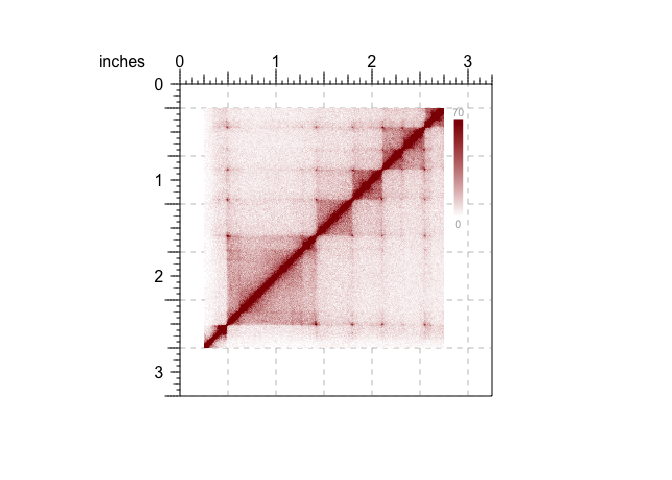

# BentoBox 

`BentoBox` is a genomic data vizualization package for R. Using `grid`
graphics, `BentoBox` empowers users to programmatically and flexibly
generate multi-panel figures. `BentoBox` accomplishes these goals by
utilizing 1) a coordinate-based plotting system, and 2) edge-to-edge
containerized data visualization. The coordinate-based plotting system
grants users precise control over the size, position, and arrangement of
plots. Its edge-to-edge plotting functions preserve the mapping between
user-specified containers and the represented data. This allows users to
stack plots with confidence that vertically aligned data will correspond
to the same regions. For more information about BenoBox’s philosophy and
design, check out the `Our Philosophy` page.

Specialized for genomic data, `BentoBox` also contains functions to read
and plot multi-omic data quickly and easily. `BentoBox` can address an
endless number of use cases, including: dynamic exploration of genomic
data, arrangment into multi-omic layouts, and survey plotting for
quickly viewing data across the genome. Check out our `vignettes` for
detailed examples and suggested use cases\!

## Installation

BentoBox can be installed from GitHub as follows:

``` r
if (!requireNamespace("BiocManager", quietly = TRUE))
    install.packages("BiocManager")

if (!requireNamespace("remotes", quietly = TRUE))
    BiocManager::install("remotes")

remotes::install_github("PhanstielLab/BentoBox")
package.version("BentoBox")
```

## Examples

### Quick plotting

We can use any of the plotting functions to quickly plot a single data
type by simply ignoring the arguments that define the plotting location
(i.e. `x`, `y`, `width`, `height`, `just`, `default.units`).

Lets demonstrate this by plotting the example Hi-C data included in
bb\_hicData (chr21:28000000-30300000):

``` r
## Load BentoBox
library(BentoBox)

## Load example Hi-C data
data("bb_hicData")

## Quick plot Hi-C data
hicPlot <- bb_plotHicSquare(data = bb_hicData,
                            chrom = "chr21", chromstart = 28000000, chromend = 30300000)
```


In addition to plotting the Hi-C Data, this creates an S3 object of
class `bb_hicSquare` which stores all of the information about the
region being plotted, the genome assembly, and any plotting parameters.

``` r
class(hicPlot)
## [1] "bb_hicSquare"
```

``` r
print(hicPlot)
## $chrom
## [1] "chr21"
## 
## $chromstart
## [1] 2.8e+07
## 
## $chromend
## [1] 30300000
## 
## $altchrom
## [1] "chr21"
## 
## $altchromstart
## [1] 2.8e+07
## 
## $altchromend
## [1] 30300000
## 
## $assembly
## $Genome
## [1] "hg19"
## 
## $TxDb
## [1] "TxDb.Hsapiens.UCSC.hg19.knownGene"
## 
## $OrgDb
## [1] "org.Hs.eg.db"
## 
## $gene.id.column
## [1] "ENTREZID"
## 
## $display.column
## [1] "SYMBOL"
## 
## $BSgenome
## [1] "BSgenome.Hsapiens.UCSC.hg19"
## 
## attr(,"class")
## [1] "bb_assembly"
## 
## $resolution
## [1] 10000
## 
## $x
## NULL
## 
## $y
## NULL
## 
## $width
## NULL
## 
## $height
## NULL
## 
## $just
## [1] "left" "top" 
## 
## $color_palette
## function (n) 
## {
##     x <- ramp(seq.int(0, 1, length.out = n))
##     if (ncol(x) == 4L) 
##         rgb(x[, 1L], x[, 2L], x[, 3L], x[, 4L], maxColorValue = 255)
##     else rgb(x[, 1L], x[, 2L], x[, 3L], maxColorValue = 255)
## }
## <bytecode: 0x7fd59705e550>
## <environment: 0x7fd597061318>
## 
## $zrange
## [1]  0 70
## 
## $half
## [1] "both"
## 
## $grobs
## gTree[GRID.gTree.1] 
## 
## attr(,"class")
## [1] "bb_hicSquare"
## attr(,"plotted")
## [1] TRUE
```

`bb_hicSquare` objects, and all objects created by `bb_plot` functions,
can saved and used later in multi-plot arrangements (see
`bb_pagePlotPlace()` and related vignettes). For different types of
plots check out the rest of the plotting functions in the Reference
section.

We can use our own data by using `bb_read` functions. This can be useful
if there are additional processing steps required.

``` r
bb_readHic(hicFile = "path/to/file.hic", ...)
```

Or if no processing is required, we can simply provide the file path
directly to the `bb_plot` function.

``` r
bb_plotHicSquare(hicData = "path/to/file.hic", ...)
```

### Multi-plot layouts

To add annotation features to a `bb_plot` object, or to view multiple
`bb_plot` objects simultaneously, we must:

1.  Create a BentoBox coordinate page with `bb_pageCreate()`.  
2.  Provide values for the placement arguments (`x`, `y`, `width`,
    `height`, `just`, `default.units`) in `bb_plot` functions.

As an annotation example, lets say we want to add a color scale legend
for a Hi-C plot:

``` r

## Load BentoBox
library(BentoBox)

## Load example Hi-C data
data("bb_hicData")

## Create a BentoBox page
bb_pageCreate(width = 3.25, height = 3.25, default.units = "inches")

## Plot Hi-C data with placing information
hicPlot <- bb_plotHicSquare(data = bb_hicData,
                            chrom = "chr21", chromstart = 28000000, chromend = 30300000,
                            x = 0.25, y = 0.25, width = 2.5, height = 2.5, default.units = "inches")

## Add color scale annotation
bb_annoHeatmapLegend(plot = hicPlot,
                     x = 2.85, y = 0.25, width = 0.1, height = 1.25, default.units = "inches")
```



By default, all placement coordinates are relative to the top right
corner of the page/plot. This can be adjusted for each function
individually with the `just` parameter. This allows us to use the most
convenient coordinates to place our plot and the ability to right, left,
center, top, bottom, or middle align every plotting element. For more
information on plot placement, check out the vignettes.

Now, let’s suppose we have both Hi-C data and signal track data such as
H3K27Ac bigWig files. We could enter the region information
(chr21:28000000-30300000) into both functions. But we can streamline
this process by taking advantage of the `bb_params()` function. Since
many functions share arguments, `bb_params()` lets us reduce repetition
by defining shared arguments in one place. Furthermore, we can
concatenate these `bb_params` objects, to create useful combinations of
parameter settings. For more information about `bb_params()` usage,
refer to the documentation or vignettes. The following code shows how we
can utilize these functions to plot Hi-C data H3K27Ac signal tracks, and
add a genomic label to a shared region:

``` r

## Load BentoBox
library(BentoBox)

## Load example Hi-C and signal track (H3K27Ac) data
data("bb_hicData")
data("bb_signalData")

## Define common region & plot-placement parameters
region <- bb_params(chrom = "chr21", chromstart = 28000000, chromend = 30300000)
params <- bb_params(x = 0.25, width = 2.5, default.units = "inches")

## Create a BentoBox page
bb_pageCreate(width = 3.25, height = 4, default.units = "inches")

## Plot Hi-C data with combined bb_params objects
hicPlot <- bb_plotHicSquare(data = bb_hicData,
                            params = c(region, params),
                            y = 0.25, height = params$width)

## Add color scale annotation
bb_annoHeatmapLegend(plot = hicPlot,
                     x = 2.85, y = 0.25, width = 0.1, height = 1.25, default.units = "inches")

## Plot H3K27Ac signal track
bb_plotSignal(data = bb_signalData,
              params = c(region, params),
              y = 3, height = 0.25)

## Label genome coordinates
bb_plotGenomeLabel(params = c(region, params),
                   y = 3.5, length = params$width, scale = "bp")
```


You might notice that using `bb_params()` we can remove quite a few of
the plotting arguments. The only things we need to specify are the data
to use and the y-coordinate to place each plot. Using `c()` we can also
combine distinct sets of `bb_params()` to create different combinations
of paramters for each function. We can also override arguments in
`bb_params()` objects by defining them in local functions if needed.

Another useful feature of `bb_params()` is the ability to build regions
and plots from gene names, given genomic annotation packages are loaded.
You can check which data packages belong to which assemblies by using
`bb_defaultPackages(Genome)` or make your own with `bb_assembly()`:

``` r
bb_defaultPackages("hg19")
## List of 6
##  $ Genome        : chr "hg19"
##  $ TxDb          : chr "TxDb.Hsapiens.UCSC.hg19.knownGene"
##  $ OrgDb         : chr "org.Hs.eg.db"
##  $ gene.id.column: chr "ENTREZID"
##  $ display.column: chr "SYMBOL"
##  $ BSgenome      : chr "BSgenome.Hsapiens.UCSC.hg19"
##  - attr(*, "class")= chr "bb_assembly"
```

Here is an example of using `bb_params()` to plot the IL1B gene using
the `gene` and `geneBuffer` arguments:

``` r
## Load assembly packages
library(TxDb.Hsapiens.UCSC.hg19.knownGene)
library(org.Hs.eg.db)
library(BSgenome.Hsapiens.UCSC.hg19)

## Plot IL1B with no buffer
bb_plotGenes(params = bb_params(gene = 'IL1B'))
```


``` r
## Plot genes with a 1000000bp (1Mb) buffer, centered on IL1B
bb_plotGenes(params = bb_params(gene = 'IL1B', geneBuffer = 1000000))
```


## A word of caution

`BentoBox` is incredibly flexible and functional. However, due to this
flexibility and like all programming packages, it may not always prevent
users from making unintentional mistakes. If plot sizes are entered
incorrectly or data is mishandled, it is possible to connect multi-omic
data incorrectly. Make sure you utilize package features that reduce
human error and increase re-usability of code to get the most milage out
of BentoBox.
