```{r, include = FALSE}
knitr::opts_chunk$set(
  collapse = TRUE,
  comment = "#>"
)
```


Plotgardener App supports several different types of plots for visualizing genomic data. See the table below for a brief description of each function, it's inputs and outputs. For more information and description of the parameters for each plot, see the info and question icons within the plotgardnerApp.

To learn more about each of the input file types, please see the [UCSC's FAQ for Data File Formats](genome.ucsc.edu/FAQ/FAQformat.html).

| Plot Function | Description | Input File | Plot |
|---|---|---|---|
| `plotSignal` | Plot any kind of signal track data for a single chromosome | `.bigWig`, `.bw` | 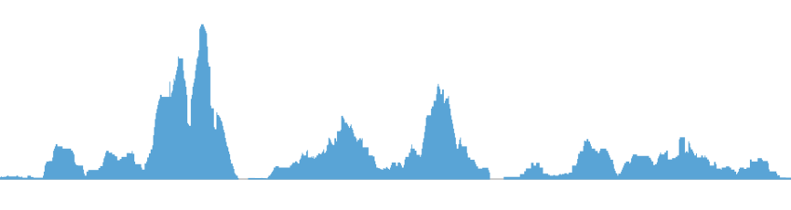 |
| `plotHicSquare`, `plotHicRectangle`, `plotHicTriangle` | Plot a Hi-C interaction matrix in a square, rectangle, or triangle format | `.hic`, `.cool`, `.mcool` | 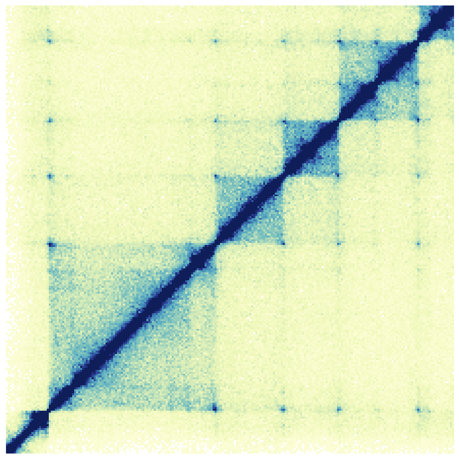 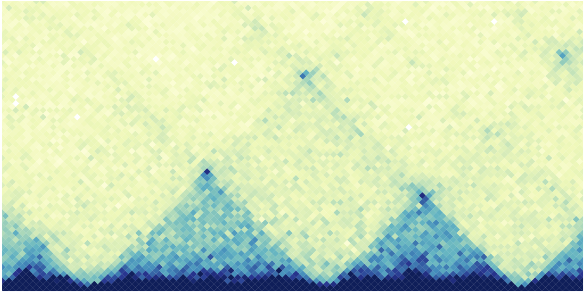 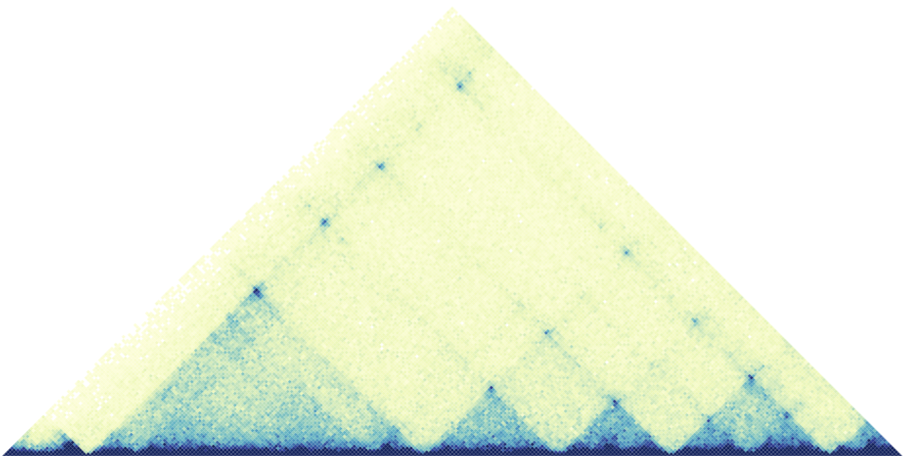 |
| `plotPairs`, `plotPairsArches` | Plot paired-end genomic range elements in line or arch format | `.bedpe` | 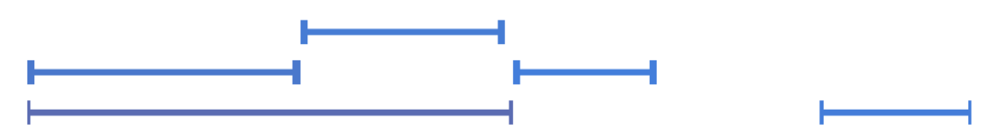 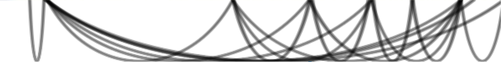 |
| `plotRanges` | Plot genomic range elements in a pileup or collapsed format | `.bed`, `.narrowPeak`, `.broadPeak` |  |
| `plotManhattan` | Plot a Manhattan plot | A `.csv` file with `chrom`, `pos`, `p` columns |  |
| `plotGenes`, `plotTranscripts` | Plot a gene or transcript track for a specified genomic region | None | 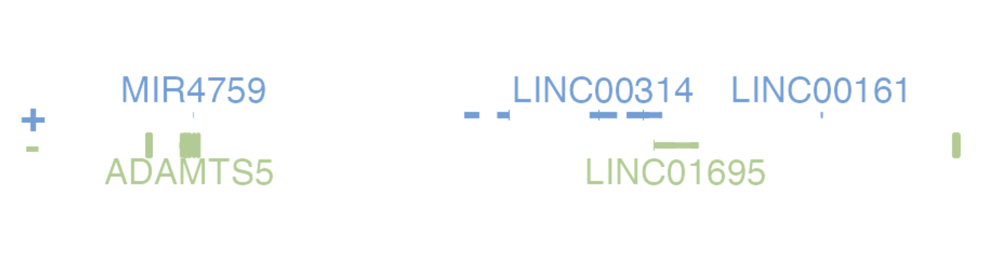 |
| `plotGenomeLabel` | Plot genomic coordinates along the x or y-axis of a plotgardener plot | None | 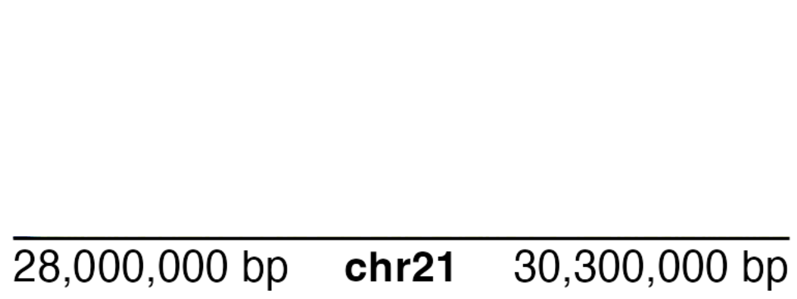 |
| `plotIdeogram` | Plot a chromosome ideogram with or without cytobands | None | 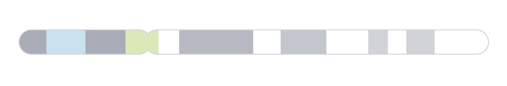 |
| `plotCircle`, `plotRect` | Add a circle or rectangle to the plot area | None |   |
| `plotText` | Add text annotations to the plot area | None | **Some Text** |


# Annotations

Annotations help you draw attention to certain areas of your plot. For more information and description of the parameters for each annotation, see the info and question icons within the plotgardnerApp.

Annotations can be added to a plot at the bottom of the plot's parameter panel with the `Add Annotation +` button. This will produce a dropdown menu with available annotations. A short description of each annotation is listed in the table below along with an example of how they might be used with some plotgardener plots.

| Annotation Function | Description | Example |
|---|---|---|---|
| `annoDomains` | Annotate domains in a Hi-C plot | 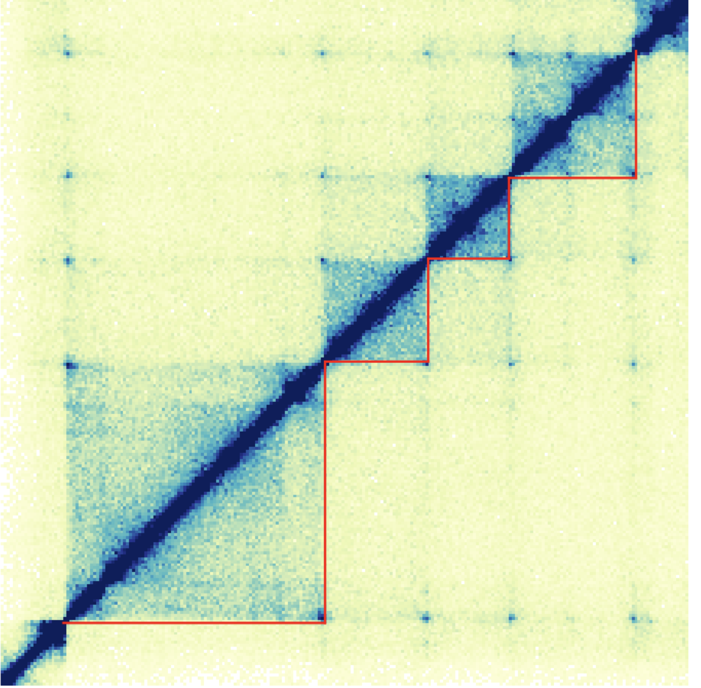 |
| `annoGenomeLabel` | Annotate genomic coordinates along the x or y-axis of a plot | 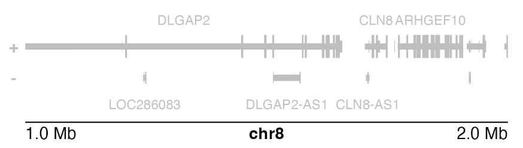 |
| `annoHeatmapLegend` | Add a color scale legend for heatmap-style plots | 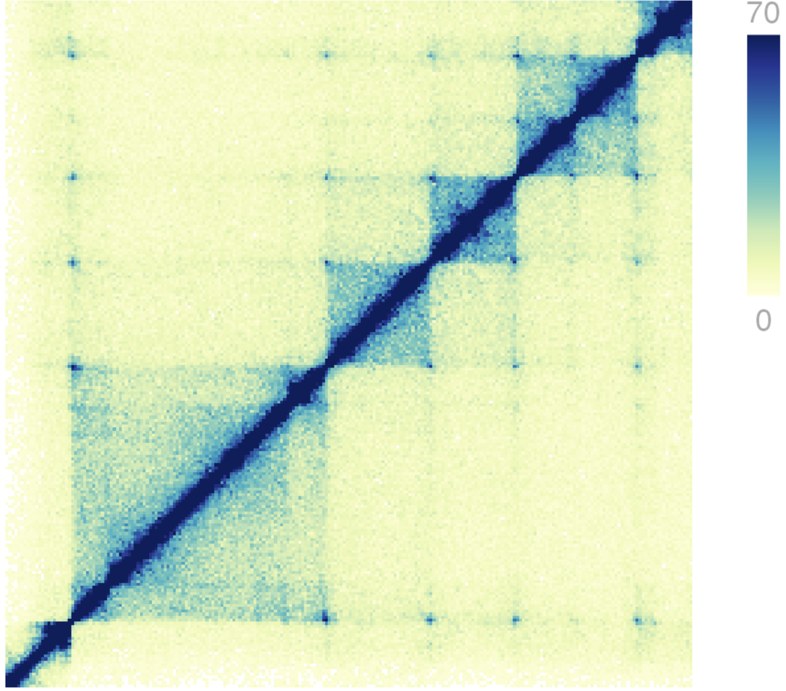 |
| `annoHighlight` | Annotates a highlight box around a specified genomic region of a plot | 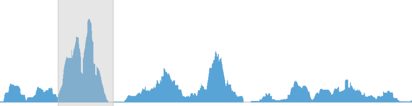 |
| `annoPixels` | Annotate pixels in a Hi-C plot | 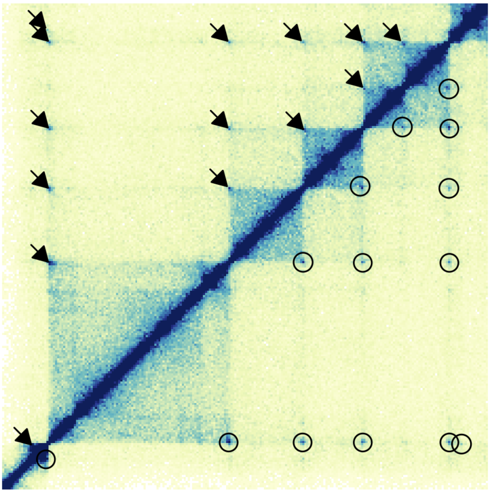 |
| `annoSegments` | Annotates a line segment within a plot | 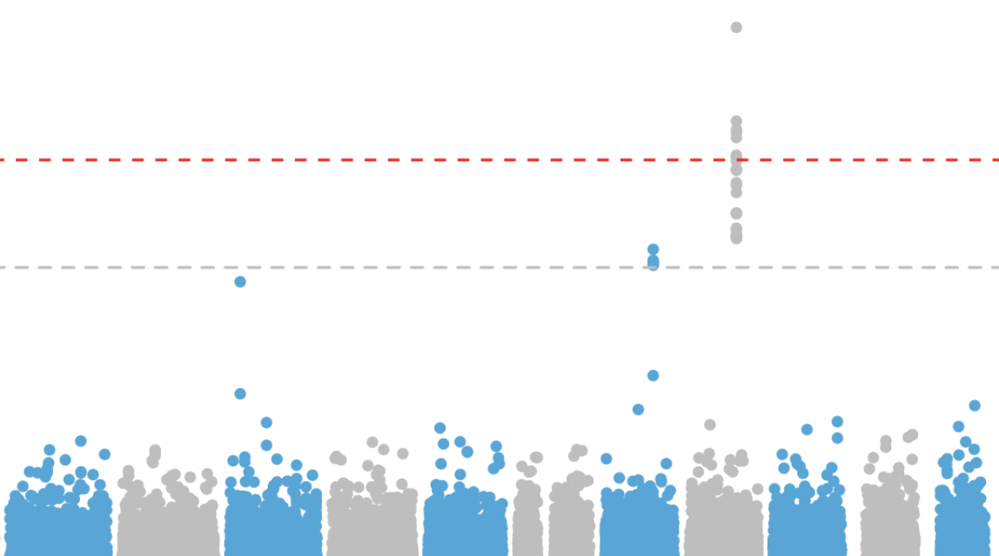 |
| `annoText` | Annotates text within a plot using the plot's genomic coordinates for positioning | 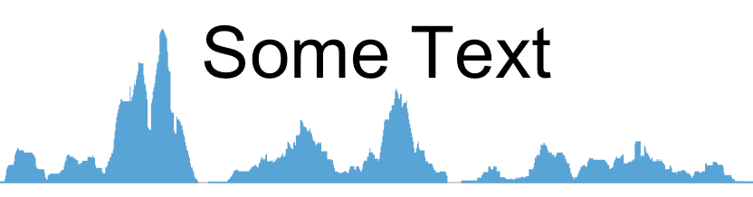 |
| `annoXaxis` | Add an x-axis to a plot | 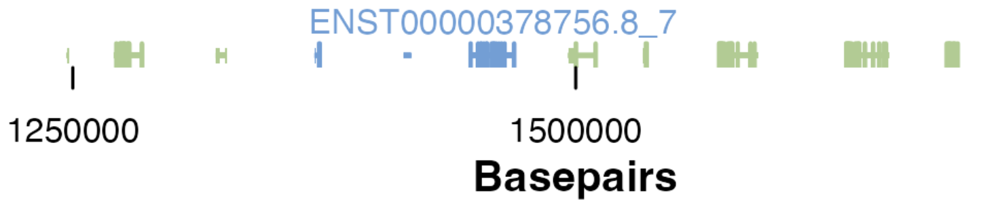 |
| `annoYaxis` | Add an y-axis to a plot | 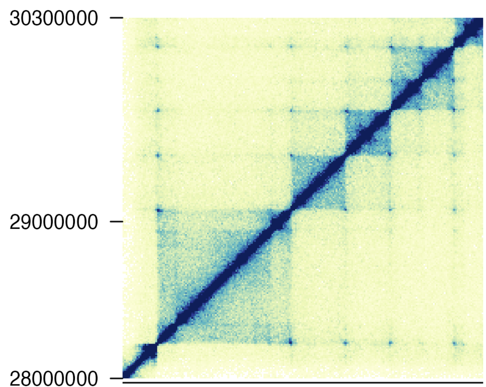 |
