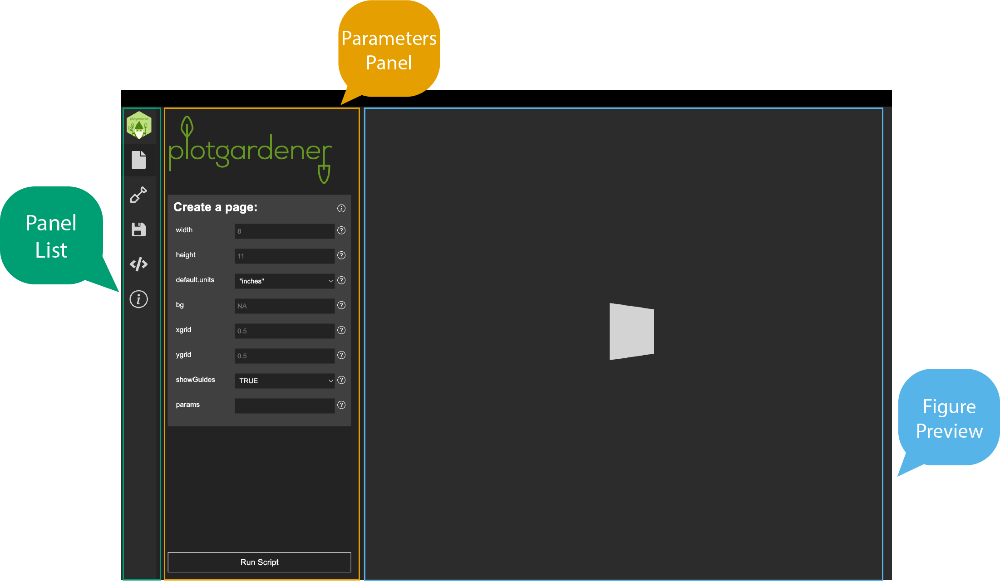

```{r setup, include = FALSE}
knitr::opts_chunk$set(
  collapse = TRUE,
  comment = "#>"
)
```

The Plotgardener App interface is divided into three regions: the
**Panel List**, the **Parameters Panel**, and the **Figure Preview**.
The **Panel List** on the left provides icon-based navigation between
four sections — **Page**, **Plots**, **Save**, and **Code**. The
**Parameters Panel** in the center displays the relevant controls for
whichever section is active. The **Figure Preview** on the right shows
a live rendering of your figure. This guide walks through each section
and describes a typical workflow for building a figure from start to
finish.



## The Page Tab

Before adding any plots, use the **Page** tab to set the overall canvas
dimensions for your figure. Its settings appear in the **Parameters Panel**.

**Settings available:**

- **Width / Height**: Physical dimensions of the output figure (in the
  selected units).
- **Units**: Choose from inches (`in`), centimeters (`cm`), or
  millimeters (`mm`).
- **Default parameters**: Set package-wide defaults — such as genome
  assembly or font size — that apply across all panels unless overridden
  at the panel level.

Once you have configured the page, click **Run Script** to render a blank
page in the **Figure Preview**. Page dimensions directly determine the
size of the exported PDF. If you are targeting a specific journal figure
size (e.g., single-column = 3.5 in, double-column = 7 in), set those here.

For more on how the `plotgardener` coordinate system works, see
[The plotgardener Page](plotgardener_page.html).

## The Plots Tab

The **Plots** tab is where you add, configure, and arrange individual
visualization panels. Select it from the **Panel List** to load its
controls into the **Parameters Panel**.

### Adding a Panel

1. Select a `plotgardener` function from the **Function** dropdown in the
   **Parameters Panel**. All functions supported by the installed version
   of `plotgardener` are listed automatically.
2. Give the panel a descriptive name in the **Panel Name** field.
3. Upload your data file using the **Browse** button next to the
   relevant data parameter.
4. Fill in the required parameters (clearly labeled in the interface).
   Optional parameters can be left at their defaults.
5. Click **Add Plot** to place the panel on the page.
6. Click **Run Script** to render the updated figure in the **Figure Preview**.

### Editing a Panel

Select any existing panel from the **Panel List**, adjust its parameters
in the **Parameters Panel**, and click **Update Plot**, then **Run Script**
to re-render.

### Adding Annotations

To layer annotations onto an existing panel (e.g., a highlight box,
genome axis, or domain boundary), select the target panel from the
**Panel List**, then choose an annotation function from the **Annotations**
dropdown and configure its parameters. See [Plot Annotations](annotations.html)
for details on available annotation types.

### Supported Input Formats

The app accepts the same data formats as the `plotgardener` R package:

| Plot Function | Accepted Formats |
|---|---|
| `plotSignal` | `.bigWig`, `.bw` |
| `plotHicSquare`, `plotHicRectangle`, `plotHicTriangle` | `.hic`, `.cool`, `.mcool` |
| `plotGenes`, `plotTranscripts` | Bioconductor annotation packages (e.g., `TxDb.*`) |
| `plotPairs`, `plotPairsArches` | `.bedpe` |
| `plotRanges` | `.bed`, `.narrowPeak`, `.broadPeak` |
| `plotManhattan` | Data frame with `chrom`, `pos`, `p` columns |

For a full description of data formats and how to prepare your files,
see [Reading Data for plotgardener](reading_data_for_plotgardener.html).

## The Save Tab

The **Save** tab lets you preserve and restore your entire figure
session. Select it from the **Panel List** to access its controls in
the **Parameters Panel**.

- **Save Session**: Exports the current configuration — all panels,
  parameter values, and page settings — as a structured `.json` file.
- **Load Session**: Imports a previously saved `.json` file to restore a
  figure exactly as it was, including all panels and their parameter
  values.

Sessions are portable across machines, making it straightforward to
share figure templates with collaborators or reproduce figures in a
different environment.

## The Code Tab

The **Code** tab displays the R script that the app generates from your
current panel configuration. Select it from the **Panel List** to view
the script in the **Parameters Panel**.

- The script updates in real time as you add, remove, or modify panels.
- Click **Copy** to copy the full script to your clipboard and paste it
  into RStudio or any other IDE.
- Advanced users can use this script as a starting point for
  customization beyond what the GUI supports — adding custom color
  palettes, looping over multiple regions, or integrating with other
  Bioconductor objects.

This tab is particularly useful for learning: configure a plot in the
**Plots** tab, then switch to **Code** to inspect the equivalent
`plotgardener` R function calls.

## Typical Workflow

A complete figure-building session follows this sequence:

1. **Set the page** — Select the **Page** tab from the **Panel List**,
   enter your figure dimensions and units in the **Parameters Panel**,
   and click **Run Script**.
2. **Add your first panel** — Select the **Plots** tab, choose a
   function, upload your data, and enter the genomic coordinates
   (chromosome, start, end) and any required parameters.
3. **Preview the figure** — Click **Run Script**. The **Figure Preview**
   on the right renders the current figure.
4. **Add more panels** — Repeat steps 2–3 for each additional track or
   panel, positioning them on the page using the x, y, width, and height
   parameters.
5. **Add annotations** — Layer genome axis labels, highlight regions,
   domain boundaries, or other annotations onto existing panels.
6. **Save your session** — Select the **Save** tab and export the
   session as a `.json` file for later use or sharing.
7. **Export the R script** — Select the **Code** tab and copy the
   generated script for archiving, further customization, or
   reproducibility.

## Further Resources

- [Reading Data for plotgardener](reading_data_for_plotgardener.html) —
  data format details and loading functions
- [Plot Annotations](annotations.html) — all available annotation
  functions
- [The plotgardener Page](plotgardener_page.html) — coordinate system
  and page layout
- [plotgardener Meta Functions](plotgardener_meta_functions.html) —
  `pgParams`, assemblies, and color utilities
- [`plotgardener` R package documentation](https://phanstiellab.github.io/plotgardener)
