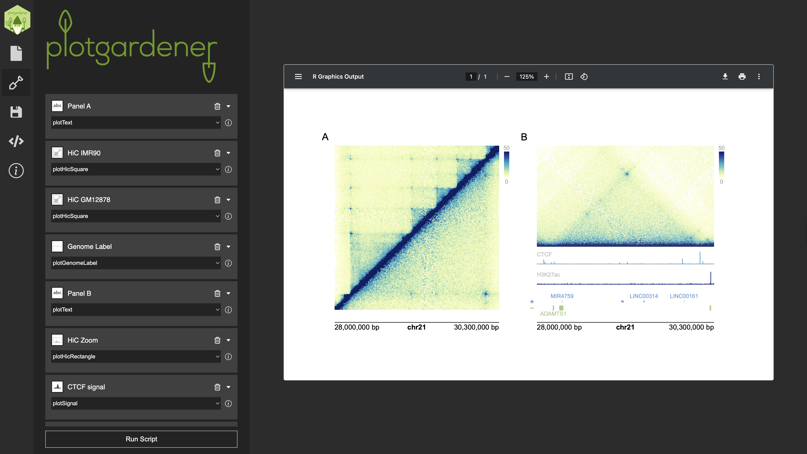

```{r setup, include = FALSE}
knitr::opts_chunk$set(
    collapse = TRUE,
    comment = "#>"
)
```

## Publication-quality genomic figures. No code required.

`plotgardener` is powerful, but using it requires proficiency in R, package
management, and the command line. For many biologists, that can be a
significant barrier.

**plotgardenerUI** is a cross-platform desktop application that wraps the full
`plotgardener` R package in a graphical interface, making its complete feature
set available in a no-code, point-and-click environment. Users can add and
configure Hi-C contact maps, signal tracks, gene models, genome labels, and
more — all through menus and form inputs — while previewing a live rendering
of their figure as they work. When the figure is ready, the app displays the
underlying R script so that advanced users can copy and extend it further in
any IDE.



## Installation

plotgardenerUI is distributed as a single installer file that bundles all
prerequisites — **no R installation or terminal setup required**.

1. Download the latest release from
   [GitHub](https://github.com/rishabhsvemuri/pgUI) (available for Windows
   and macOS)
2. Double-click the installer to install
3. Open the app and start building

## How it works

The interface is organized into four tabs:

**Page** — Set page dimensions and units before adding any plots.

**Plots** — Add, name, and configure as many plot panels as needed, chosen
from a dropdown of all supported `plotgardener` functions. Each panel includes
data upload via browse buttons, text parameter fields, and automatic validation
of required inputs. Annotations can be layered on top of any plot panel.

**Save** — Save and reload your entire session as a structured JSON file,
enabling figure templates and easy sharing between collaborators across
machines.

**Code** — View the R script the app generates in real time. Copy it directly
into an IDE for further customization.

Clicking **Run Script** compiles all panel inputs, executes the R script in a
background session, and displays the rendered figure in the always-open preview
pane.

## Under the hood

plotgardenerUI is built on [Electron](https://www.electronjs.org/) and
comprises three layers:

- **Frontend (React):** Renders all user-facing tabs and form elements,
  dynamically populated based on the selected `plotgardener` function.

- **Backend (Node.js):** Manages all parameter inputs, maintains panel state
  across additions and edits, compiles the final R script, and returns the PDF
  output to the preview pane.

- **Parser (Python):** Parses the live `plotgardener` R package source
  (functions, parameters, and documentation) into structured JSON. This means
  the interface stays automatically synchronized with any updates to the
  package, with no manual maintenance required.

## Source code & documentation

- plotgardenerUI source: [github.com/rishabhsvemuri/pgUI](https://github.com/rishabhsvemuri/pgUI)
- plotgardener R package docs: [phanstiellab.github.io/plotgardener](https://phanstiellab.github.io/plotgardener)
